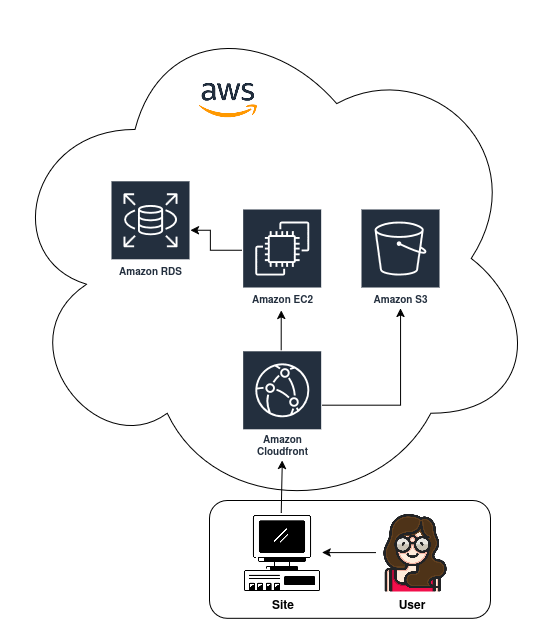

# AWS Code Girls - Santander & DIO
 Repositório de estudos e projetos desenvolvidos durante o Bootcamp AWS Code Girls, uma parceria entre Santander e DIO. Este espaço é dedicado a consolidar meu aprendizado em serviços fundamentais da Amazon Web Services (AWS), como **EC2**, **S3**, **IAM**, entre outros.

### 📚 Sobre o Repositório
Este repositório serve como um portfólio de meus desafios práticos e projetos, documentando minha jornada de aprendizado em nuvem. O objetivo é aplicar os conceitos teóricos das aulas em cenários práticos, demonstrando a compreensão dos serviços AWS e sua arquitetura.

### 🎯 Objetivos de Aprendizagem

Ao longo deste bootcamp, meu foco é:

* Criar, configurar e conectar-se a máquinas virtuais na nuvem.
* Gerenciar armazenamento de objetos de forma escalável.
* Controlar o acesso a recursos AWS de forma segura.
* Utilizar o GitHub para organizar e apresentar meu progresso de forma clara e profissional.

### 💻 Projetos e Desafios
Esta seção listará os principais projetos e desafios que foram ou serão desenvolvidos ao longo do bootcamp. 

### Desafio 1: Gerenciamento de Instância EC2

* **Descrição:** Configuração e gerenciamento de uma instância Amazon EC2.
* **Arquitetura:** [Diagrama da Arquitetura AWS](images/diagrama_ec2_aws.png)
* **Tecnologias Utilizadas:** Draw.io para o diagrama representando as ferramentas AWS vistas em aula.
* **Insights:** Neste desafio, aprendi a interligar diferentes serviços AWS, como um servidor web (EC2) que se conecta a um banco de dados (RDS) e entrega conteúdo estático a partir de um bucket (S3) com a ajuda do CloudFront para otimizar o desempenho.

### Desafio 2: Criar S3, alterar políticas e fazer upload do website
* **📂Repositório:** [Na pasta cima ou clicando aqui](https://github.com/Bootcamp-AWS-DIO/website-aws).
* **👩‍💻 Acesse o projeto:** [Clique aqui :) ](https://kellitissot.github.io/website-formacao-aws/)
