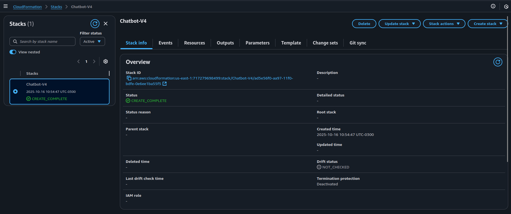
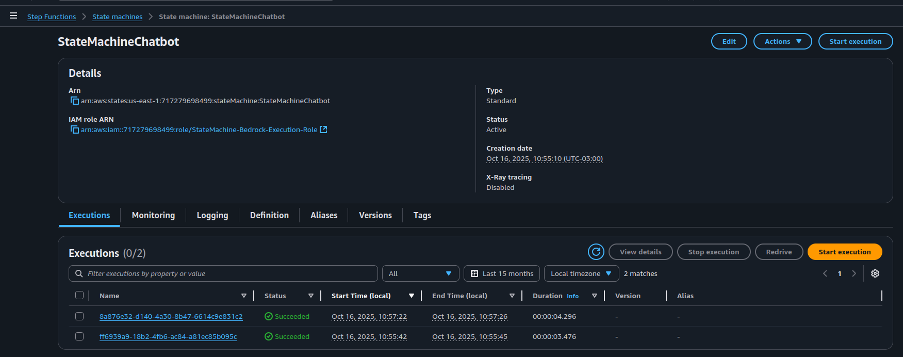

# Desafio 3 - Step Function Chatbot com Amazon Bedrock (via CloudFormation)

Este projeto usa **AWS CloudFormation** para implantar uma **AWS Step Function** que orquestra interações com um Modelo de Linguagem Grande (LLM) do **Amazon Bedrock**.

A Step Function atua como um "chatbot" simples, encadeando prompts e utilizando o Bedrock para gerar respostas.

## 🚀 Pré-requisitos

1.  **Conta AWS Configurada:** Credenciais de acesso com permissão para criar recursos no IAM, CloudFormation, Step Functions e Bedrock.
2.  **Acesso ao Modelo Bedrock:** Você **DEVE** habilitar o acesso ao modelo **manualmente** na sua conta AWS antes da implantação.

    * **Modelo Usado no Template:** `amazon.titan-text-lite-v1`
    * **Região:** `us-east-1` (Verifique se é a região onde você está implantando)

    **🚨 Passo Manual Necessário:** Vá ao console do **Amazon Bedrock** -> **Model catalog** -> **Request model access** e habilite o modelo utilizado aqui. Caso queira utilizar outro modelo, consulte as alterações necessárias descritas na seção **[Mudar o modelo LLM](#mudar-o-modelo-llm)**.

## 🛠️ Implantação

O template do CloudFormation cuida de toda a configuração, incluindo:

1.  **AWS::IAM::Role:** Cria a *Role* de execução necessária para a Step Function, já com a política `bedrock:InvokeModel` anexada.
2.  **AWS::StepFunctions::StateMachine:** Cria a máquina de estado (**Chatbot**) que define o fluxo de interação com o Bedrock.

## ❗Mudar o modelo LLM
Caso deseje usar um outro modelo, é necessário fazer duas alterações no template do CloudFormation:

1. Atualizar o ID do Modelo (Template JSON)
* Localizar o recurso <b>DefinitionSubstitutions -> bedrockinvokeModel_ModelId</b> e trocar o ARN do modelo pelo ARN do novo modelo desejado.

2. Atualizar a Permissão do IAM (Template JSON)
* Localize a seção <b>Policies -> PolicyDocument -> Resource</b> e atualize para o novo ARN.

## 🚀 Como Criar uma Stack no CloudFormation
1. Acesse o Console: Na AWS, procure por CloudFormation.
2. Inicie a Criação: Clique em Criar stack > Com novos recursos (padrão).
3. Envie o Template: Escolha Fazer upload de um arquivo de modelo e selecione o arquivo (.json ou .yaml).
4. Preencha os Detalhes:
    * Dê um Nome para a stack.
    * Preencha os Parâmetros solicitados.
5. Crie a Stack:
    * Clique em Avançar nas próximas telas.
    * Revise e clique em Criar stack.

* **Aguarde o status mudar para CREATE_COMPLETE.**

## Prints do ambiente criado
### ✔️ Stack criada no CloudFormation

### ✔️ State Machine rodando no StepFunctions

