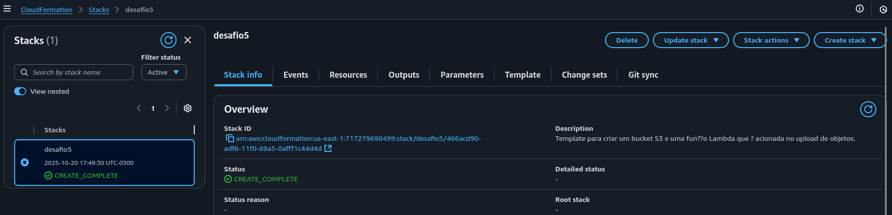
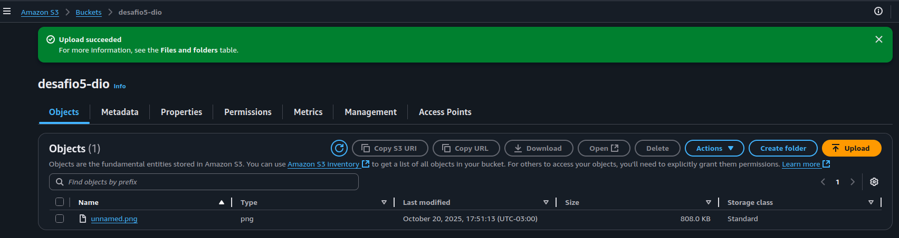
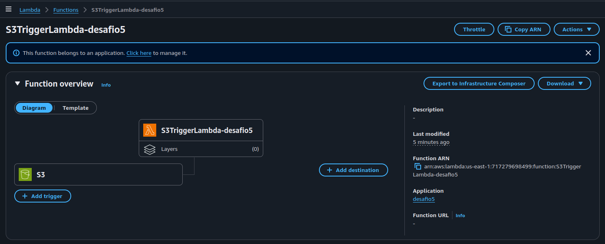
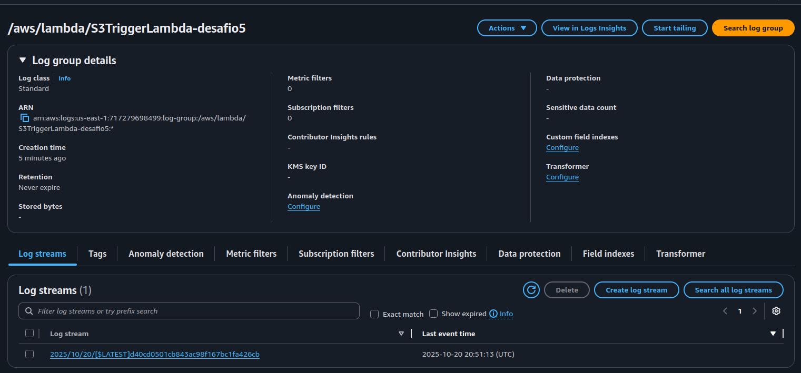

# Desafio 5: Automação de Tarefas com AWS Lambda e S3

Repositório criado para documentar a solução do Desafio de Projeto "Executando Tarefas Automatizadas com Lambda Function e S3", parte do bootcamp AWS da [DIO](https://www.dio.me/).

O objetivo deste laboratório foi construir uma solução serverless na AWS para processar arquivos de forma automática. A infraestrutura foi totalmente provisionada utilizando **AWS CloudFormation**, reforçando os conceitos de Infraestrutura como Código (IaC).

---

## 🎯 Objetivo

Criar um pipeline de automação onde o upload de um arquivo em um bucket **S3** aciona automaticamente uma função **Lambda**. A função, por sua vez, processa a notificação do evento e registra as informações em logs do **CloudWatch**.

## 🏛️ Arquitetura da Solução

A arquitetura implementada é baseada em eventos e 100% serverless, utilizando os seguintes serviços da AWS:

1.  **Amazon S3 (Simple Storage Service):** Atua como o ponto de entrada (trigger) do nosso fluxo. É configurado para armazenar os arquivos e notificar a função Lambda sempre que um novo objeto é criado.
2.  **AWS Lambda:** Uma função em Python que é executada em resposta ao evento do S3, sem a necessidade de gerenciar servidores.
3.  **AWS IAM (Identity and Access Management):** Garante a comunicação segura entre os serviços, fornecendo as permissões necessárias para que a Lambda seja executada e acesse outros recursos da AWS (como o CloudWatch).
4.  **Amazon CloudWatch:** Utilizado para monitoramento e logging. A função Lambda envia os logs de sua execução para o CloudWatch, permitindo a verificação e o debugging da automação.


## 🛠️ Infraestrutura como Código (IaC) com CloudFormation

Toda a infraestrutura descrita acima foi provisionada utilizando um único template do AWS CloudFormation. Esta abordagem garante que o ambiente seja:

* **Reprodutível:** Qualquer pessoa pode criar a mesma infraestrutura de forma consistente.
* **Versionável:** O template pode ser versionado em um repositório Git, como este.
* **Automatizado:** A criação, atualização e exclusão dos recursos são gerenciadas pelo CloudFormation.

### Estrutura do Repositório
```
.
├── images/                     # Contendo prints dos serviços em funcionamento
├── s3-lambda-automation.json   # Template do CloudFormation com a definição da infraestrutura
└── README.md                   # Documentação do projeto (este arquivo)
```

### Recursos Criados pelo Template

O arquivo `s3-lambda-automation.json` define os seguintes recursos:

1.  `AWS::S3::Bucket`: O bucket que receberá os arquivos.
2.  `AWS::IAM::Role`: A permissão de execução (`Execution Role`) para a função Lambda, permitindo que ela escreva logs no CloudWatch.
3.  `AWS::Lambda::Function`: A função em Python 3.9, com o código-fonte embutido no template.
4.  `AWS::Lambda::Permission`: A permissão que autoriza o serviço S3 a invocar a função Lambda.

A conexão entre o S3 e a Lambda é feita através da propriedade `NotificationConfiguration` no recurso do bucket.

## 🚀 Como Executar o Projeto

Para replicar esta solução, siga os passos abaixo:

### Pré-requisitos
* Uma conta na AWS.
* Um nome de bucket S3 em mente (lembre-se que ele deve ser globalmente único).

### Passos para Deploy
1.  Acesse o **Console da AWS** e navegue até o serviço **CloudFormation**.
2.  Clique em **"Criar stack"** e selecione "Com novos recursos (padrão)".
3.  Na seção "Especificar modelo", escolha **"Fazer upload de um arquivo de modelo"** e suba o arquivo `s3-lambda-automation.json` deste repositório.
4.  Clique em "Avançar".
5.  Dê um nome para a sua stack (ex: `desafio-dio-s3-lambda`).
6.  No campo de **Parâmetros**, insira o nome único que você escolheu para o `S3BucketName`.
7.  Clique em "Avançar" até a última tela, confirme as permissões e clique em **"Criar stack"**.
8.  Aguarde alguns minutos até que o status da stack mude para `CREATE_COMPLETE`.

## ✅ Testando a Automação

1.  No console da AWS, navegue até o serviço **S3**.
2.  Encontre o bucket que foi criado pela stack e clique nele.
3.  Faça o upload de qualquer arquivo de teste.
4.  Agora, navegue até o serviço **CloudWatch**.
5.  No menu à esquerda, clique em **"Grupos de logs"**.
6.  Encontre e clique no grupo de logs associado à sua função Lambda.
7.  Dentro do log stream mais recente, você verá uma mensagem de log confirmando a execução.

## ✨ Principais Aprendizados

* **Poder da Arquitetura Orientada a Eventos:** Compreender na prática como serviços desacoplados podem se comunicar de forma eficiente através de eventos.
* **Infraestrutura como Código (IaC):** A utilização do CloudFormation para definir e provisionar recursos de forma declarativa e segura é fundamental para ambientes de nuvem modernos e escaláveis.
* **A Importância das Permissões (IAM):** A configuração correta de Roles e Permissions, garantindo que cada serviço tenha apenas o acesso mínimo necessário para operar (Princípio do Menor Privilégio).


## 📸 Prints do ambiente criado 

## CloudFormations


## Bucket S3


## Lambda Functions


## CloudWatch



Feito por **Kelli Tissot Moraes** 👋 [Meu LinkedIn](https://www.linkedin.com/in/kellitmoraes/)